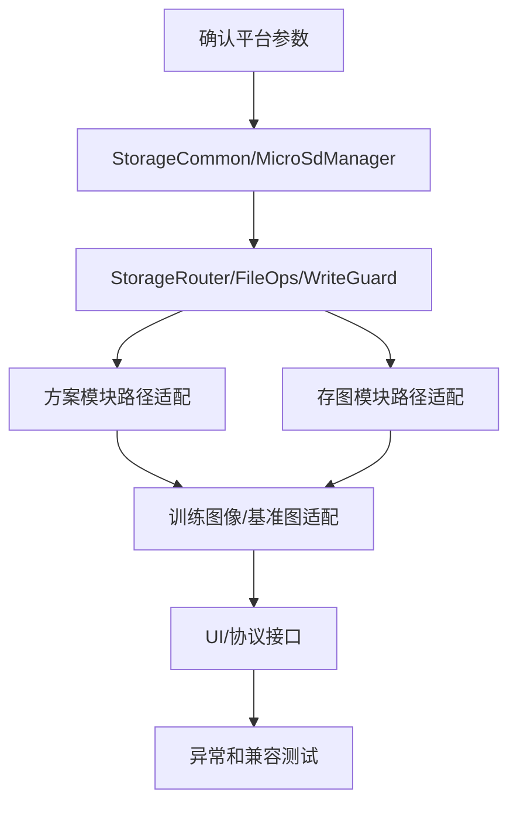

# microSD 卡实现计划

## 1. 目标

实现 microSD 卡业务存储能力，并将方案、图片、训练图像从固定 `/mnt/data` 路径迁移到统一存储接口。计划先完成基础设施和业务适配，再补充 UI/协议与异常测试。

## 2. 实施原则

1. 先做统一存储接口，再改业务模块，避免继续扩散硬编码路径。
2. 先保证 eMMC 兼容，所有旧数据仍可读取。
3. 业务数据支持 SD；系统基础数据不迁移。
4. 每个业务模块改造时保留小步提交和可回退边界。
5. 写入 SD 失败不降级 eMMC。

## 3. 阶段计划

### 阶段 0：确认平台参数

| 序号 | 任务 | 输出 |
| --- | --- | --- |
| 0.1 | 确认 SD 设备节点和挂载点，例如 `/dev/mmcblkXpY`、`/mnt/sdcard`。 | 平台参数表 |
| 0.2 | 确认热插拔事件来源：udev、轮询、驱动回调或现有 peripheral API。 | 事件接入方案 |
| 0.3 | 验证 FAT32 与 32KB 簇大小检测方式。 | 检测命令/API |
| 0.4 | 验证格式化命令能否生成 FAT32 + 32KB 簇。 | 格式化命令 |
| 0.5 | 确认“至少 128GB”的产品含义。 | 容量准入规则 |

### 阶段 1：新增存储基础模块

| 序号 | 任务 | 涉及文件建议 |
| --- | --- | --- |
| 1.1 | 新增 `StorageCommon`：介质枚举、业务类型、状态、错误码、路径结构。 | `source/middleware/storage/StorageCommon.h` |
| 1.2 | 新增 `MicroSdManager`：状态机、挂载、卸载、格式校验、容量统计。 | `source/middleware/storage/MicroSdManager.*` |
| 1.3 | 新增 `FileOps`：mkdir、statfs、atomic write、remove、sync。 | `source/middleware/storage/FileOps.*` |
| 1.4 | 新增 `WriteGuard`：写入 token、空间检查、弹出取消、generation 校验。 | `source/middleware/storage/WriteGuard.*` |
| 1.5 | 新增 `StorageRouter`：默认策略、业务根目录解析、聚合根目录。 | `source/middleware/storage/StorageRouter.*` |
| 1.6 | 新增 C API 适配层，给 C 模块调用。 | `source/middleware/storage/StorageApi.h/.cpp` |
| 1.7 | 接入初始化和反初始化流程。 | `source/app/main/main.c` 或现有 middleware init 点 |

### 阶段 2：方案模块适配

| 序号 | 任务 | 涉及文件建议 |
| --- | --- | --- |
| 2.1 | 新增 `ProjectStorageAdapter` C 接口，封装方案包、工作目录、索引路径。 | `source/fwk/project/project_storage_adapter.*` |
| 2.2 | 替换新建/保存/上传方案路径解析，写入目标经 `StorageRouter`。 | `source/fwk/project/framework_proj.c` |
| 2.3 | 设计并实现 SD 方案 manifest 读写，设备保存/删除 SD 方案时同步更新 manifest。 | `framework_proj.c`、`project_storage_adapter.*` |
| 2.4 | manifest 读取做 schema、路径、数量、文件存在性、大小/mtime/hash 校验。 | `ProjectRepository` 或 `project_storage_adapter.*` |
| 2.5 | 方案列表查询改为 eMMC + SD manifest 聚合，记录携带 media/status，不解压 `.sln`。 | `source/fwk/project/framework_proj.c` |
| 2.6 | manifest 缺失/损坏时返回 SD 索引异常状态，保留 eMMC 方案正常展示。 | `source/app/comif/communication_interface.cpp` |
| 2.7 | 可选实现 eMMC 侧 SD manifest 摘要缓存，用于判断是否需要重新校验。 | `source/fwk/project/project_storage_adapter.*` |
| 2.8 | 加载/删除/重命名方案支持 media；旧协议缺省时按 eMMC 优先解析。 | `source/fwk/project/framework_proj.c`、`source/app/comif/communication_interface.cpp` |
| 2.9 | SD 异常移除事件通知方案模块，当前 SD 方案进入存储失效状态。 | `framework_proj.c` + event callback |

### 阶段 3：存图模块适配

| 序号 | 任务 | 涉及文件建议 |
| --- | --- | --- |
| 3.1 | 将 `DEVRAW_DIR` 使用点替换为运行时保存目录。 | `source/algos/modules/saveimage/save_proc.*` |
| 3.2 | 存图线程写前调用 `BeginWrite`，失败返回明确错误。 | `save_proc.cpp` |
| 3.3 | SD 目标禁用循环覆盖旧图，空间不足直接失败。 | `save_proc.cpp` |
| 3.4 | 图片 DB 支持按介质路径打开或多实例管理。 | `source/misc/db/img_list_db/*` |
| 3.5 | 查询/删除保存图片时根据 media 操作对应文件和 DB。 | `source/app/comif/communication_interface.cpp` |

### 阶段 4：训练图像和基准图适配

| 序号 | 任务 | 涉及文件建议 |
| --- | --- | --- |
| 4.1 | 基准图、训练图像文件夹路径跟随方案介质。 | `source/algos/modules/baseimage/*` |
| 4.2 | 删除训练图像文件夹改走 StorageService 删除与日志。 | `imagesetmanager.cpp`、`imageset.cpp` |
| 4.3 | 训练图像列表聚合 eMMC 与 SD。 | `baseimage` + comif 查询接口 |
| 4.4 | 测试图 DB 支持按介质路径打开或多实例管理。 | `source/misc/db/test_img_list_db/*` |

### 阶段 5：UI/协议和配置

| 序号 | 任务 | 涉及文件建议 |
| --- | --- | --- |
| 5.1 | 增加 SD 状态查询接口：状态、容量、文件系统、可写。 | `source/app/comif/*` |
| 5.2 | 增加安全弹出接口。 | `communication_interface.cpp` |
| 5.3 | 增加格式化接口，包含二次确认标志。 | `communication_interface.cpp` |
| 5.4 | 增加保存介质配置接口：AUTO/microSD/eMMC。 | 参数模块或设备配置 |
| 5.5 | `comif_get_project_list` 返回新增 `StorageMedia`、`StorageStatus`、`IndexStatus` 字段，旧客户端可兼容忽略。 | SCMVS/Web 输出 JSON |
| 5.6 | 增加 SD 方案扫描/修复入口，后台扫描 `.sln` 并重建 manifest，不阻塞本机方案列表。 | `communication_interface.cpp` + 项目管理模块 |
| 5.7 | 界面方案列表增加来源标识和筛选：全部、本机、SD卡。 | Web/SCMVS |
| 5.8 | SD 索引异常时展示“SD卡方案索引异常，可扫描修复”。 | Web/SCMVS |
| 5.9 | 统一错误码到提示语映射。 | comif 错误处理层 |

### 阶段 6：测试与验收

| 序号 | 任务 | 验证点 |
| --- | --- | --- |
| 6.1 | 单元测试 StorageRouter。 | 默认策略、不降级、路径防逃逸、去重。 |
| 6.2 | 单元测试 WriteGuard。 | 空间不足、generation 变化、取消 token。 |
| 6.3 | 模块测试 MicroSdManager。 | FAT32、非 FAT32、簇大小错误、mount/umount 失败。 |
| 6.4 | 集成测试方案模块。 | SD 在线默认新建方案写 SD，拔卡后 SD 方案消失。 |
| 6.5 | 集成测试方案 manifest。 | manifest 缺失、损坏、伪造路径、数量超限、同名冲突、扫描修复。 |
| 6.6 | 集成测试存图模块。 | SD 写图、空间不足、写入中拔卡、显式 eMMC 写图。 |
| 6.7 | 集成测试训练图像。 | 展示、删除、拔卡后不展示。 |
| 6.8 | 兼容测试旧数据。 | 原 `/mnt/data` 方案、图片仍可读可删。 |

## 4. 建议改造顺序

## 5. 重点代码修改清单

| 优先级 | 文件/目录 | 修改内容 |
| --- | --- | --- |
| P0 | `source/middleware/storage/` | 新增统一存储模块。 |
| P0 | `source/fwk/project/framework_proj.c` | 替换方案路径宏使用，支持 media。 |
| P0 | `source/fwk/project/project_storage_adapter.*` | 方案 manifest、聚合查询、SD 索引校验和可选缓存。 |
| P0 | `source/app/comif/communication_interface.cpp` | 上层接口支持 SD 状态、media 字段、聚合查询、索引异常和扫描入口。 |
| P0 | `source/algos/modules/saveimage/save_proc.*` | 存图路径、空间检查、写入保护。 |
| P1 | `source/misc/db/img_list_db/*` | 图片 DB 多介质化。 |
| P1 | `source/misc/db/test_img_list_db/*` | 测试/训练图 DB 多介质化。 |
| P1 | `source/algos/modules/baseimage/*` | 训练图像文件夹和基准图跟随方案介质。 |
| P2 | `source/middleware/emmc/*` | 只做必要接口联动，避免改坏 eMMC 寿命逻辑。 |
| P2 | `source/app/web/*` | 如 Web 侧直接读路径或状态，补充展示字段。 |

## 6. 回归风险控制

1. 第一轮只替换业务数据路径，不动 core、ABI、oplog、系统配置路径。
2. 所有旧宏保留为 eMMC 默认值，新增代码走接口。
3. 对外协议新增字段保持向后兼容。
4. 每完成一个业务模块，先验证无 SD 场景下旧 eMMC 行为。
5. SD 写入失败路径必须覆盖 DB 回滚、临时文件清理、错误提示。
6. `comif_get_project_list` 不在前台路径全量解压 `.sln`；只在用户触发扫描修复时后台解析。
7. SD manifest 按不可信输入处理，校验失败只影响 SD 方案展示，不影响本机方案。

## 7. 未决问题

1. 当前默认策略在“未插 SD 且用户未显式选择 eMMC”时按需求应报错；是否允许产品默认配置为 eMMC 需要确认。
2. SD 上当前运行方案被拔卡后，是继续运行内存态方案、停止运行，还是提示后允许当前帧结束，需要产品确认。
3. 同名文件写入冲突策略未定；本计划只实现读取去重。
4. FAT32 最大单文件 4GB 限制是否需要在存图前额外拦截，需要结合最大图片/视频文件大小确认。
