# microSD 卡模块详细设计文档

## 1. 模块接口总览

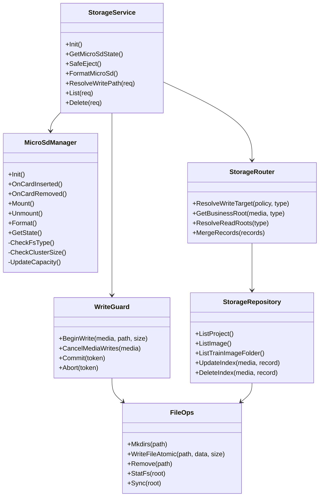

## 2. 公共数据结构

```c
typedef enum {
    STORAGE_MEDIA_EMMC = 0,
    STORAGE_MEDIA_MICROSD = 1,
    STORAGE_MEDIA_AUTO = 2
} StorageMedia;

typedef enum {
    STORAGE_BIZ_PROJECT_PACKAGE = 0,
    STORAGE_BIZ_PROJECT_WORKDIR,
    STORAGE_BIZ_SAVE_IMAGE,
    STORAGE_BIZ_TEST_IMAGE,
    STORAGE_BIZ_TRAIN_IMAGE,
    STORAGE_BIZ_PROJECT_INDEX,
    STORAGE_BIZ_IMAGE_INDEX,
    STORAGE_BIZ_TEST_IMAGE_INDEX
} StorageBusinessType;

typedef enum {
    SD_STATE_NOT_INSERTED = 0,
    SD_STATE_MOUNTING,
    SD_STATE_ONLINE,
    SD_STATE_ONLINE_READONLY,
    SD_STATE_UNSUPPORTED_FORMAT,
    SD_STATE_SPACE_LOW,
    SD_STATE_EJECTING,
    SD_STATE_EJECTED,
    SD_STATE_ABNORMAL_REMOVED,
    SD_STATE_MOUNT_FAILED,
    SD_STATE_FORMATTING
} MicroSdState;

typedef struct {
    StorageMedia media;
    StorageBusinessType type;
    char relative_path[256];
    uint64_t required_size;
    int overwrite;
} StorageWriteRequest;

typedef struct {
    StorageMedia media;
    MicroSdState sd_state;
    char abs_path[512];
    uint64_t available_size;
    uint64_t total_size;
    uint32_t generation;
} StorageResolvedPath;
```

`generation` 用于处理拔卡竞态：写入开始时记录当前 SD 挂载代数，提交前再次校验。如果拔卡后重新插卡，代数变化，旧写入 token 必须失败。

## 3. MicroSdManager 详细设计

### 3.1 职责

1. 监听插卡、拔卡事件。
2. 检查设备节点、文件系统类型、簇大小、容量、可写性。
3. 挂载到固定挂载点。
4. 安全弹出时拒绝新写入、取消已有写入、sync、umount。
5. 格式化为 FAT32 + 32KB 簇大小。
6. 发布状态变更事件。

### 3.2 挂载流程

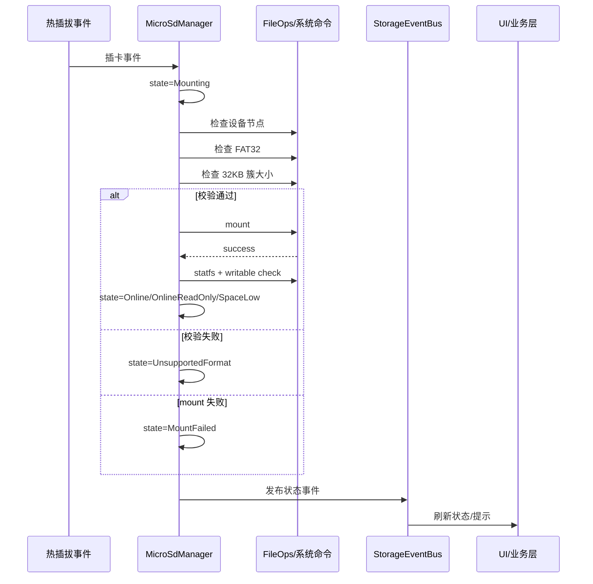

### 3.3 安全弹出流程

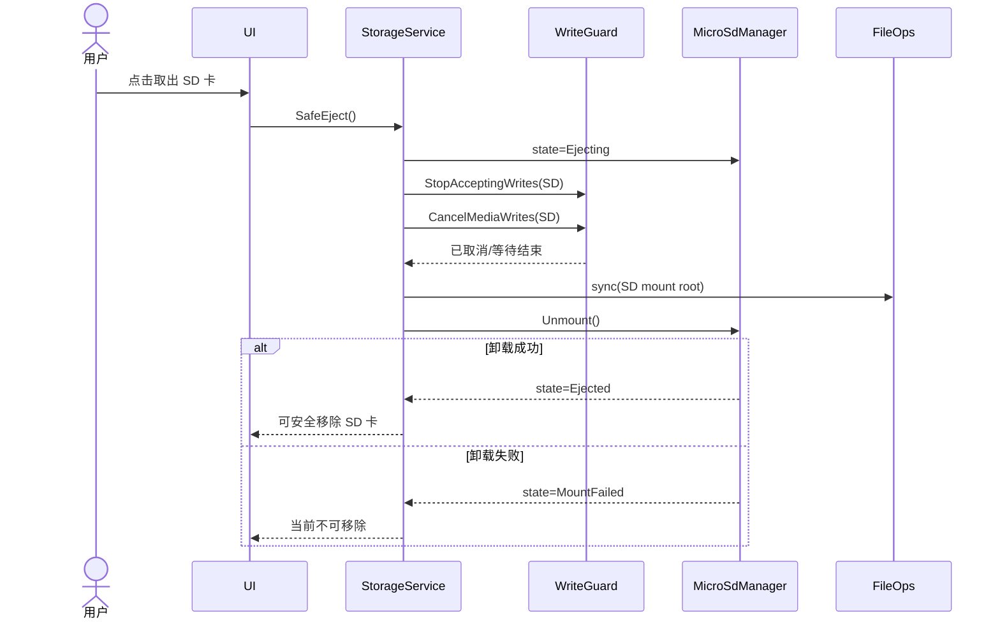

### 3.4 异常移除流程

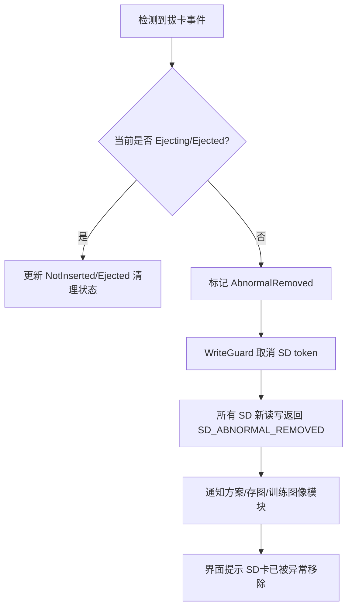

## 4. StorageRouter 详细设计

### 4.1 写入目标解析

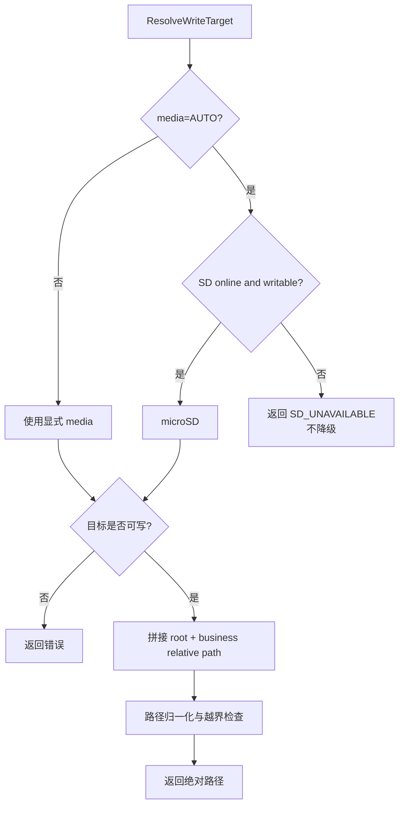

路径检查要求：

1. 用户输入目录只能作为介质根目录下的相对路径。
2. 拒绝空字节、`..` 越界、绝对路径、重复分隔符造成的逃逸。
3. 特殊字符策略未确认前，预留 `StoragePathPolicy`，默认只做安全性拦截，不主动扩展字符规则。

### 4.2 读取聚合和去重

聚合记录建议结构：

```c
typedef struct {
    StorageMedia media;
    StorageBusinessType type;
    char name[128];
    char abs_path[512];
    char display_path[256];
    uint64_t size;
    uint64_t mtime;
} StorageRecord;
```

去重规则：

1. 先加入 eMMC 记录。
2. 再加入 SD 记录。
3. 若 `name` 已存在，跳过 SD 记录。
4. 若未来需要页签或来源过滤，只在 UI 层筛选，不改变聚合器默认规则。

## 5. WriteGuard 与 FileOps 详细设计

### 5.1 写入 token

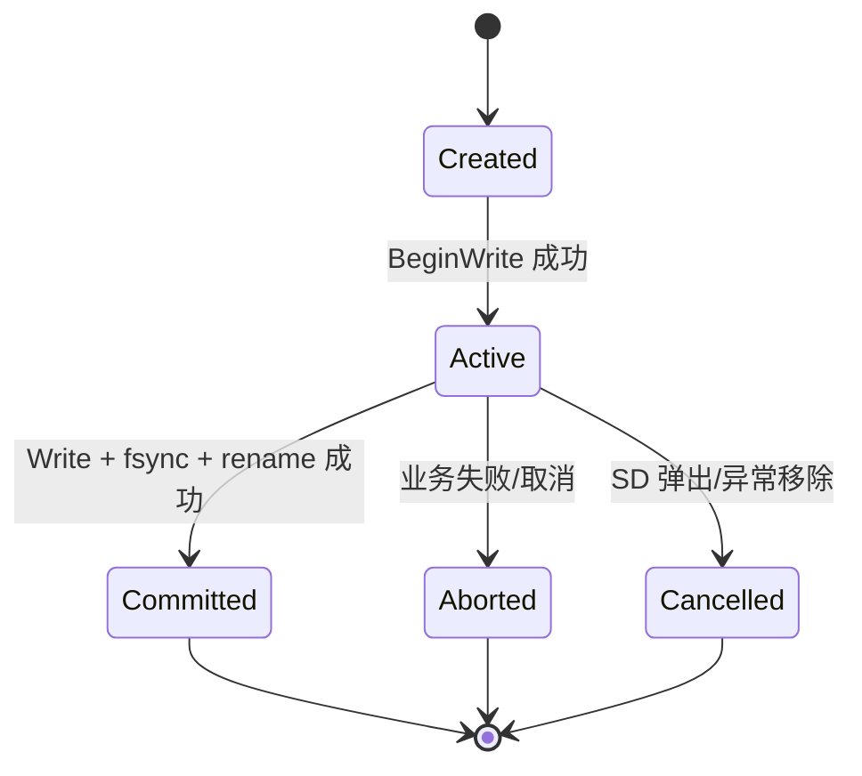

`BeginWrite` 需要完成：

1. 检查目标介质状态。
2. 记录介质 generation。
3. 检查剩余空间。
4. 登记活动写入 token。
5. 返回 token 给业务写入函数。

`CommitWrite` 需要完成：

1. 校验 token 未取消。
2. 校验 SD generation 未变化。
3. 更新索引。
4. 释放 token。

### 5.2 原子写入

文件写入统一采用：

1. 目标目录不存在则创建。
2. 写入同目录临时文件：`<name>.tmp.<pid>.<seq>`。
3. 写完后 flush/fsync。
4. rename 到目标文件。
5. 失败时删除临时文件。

这样可以满足“不允许空间不足生成半文件”的要求。对于图片流式写入，若无法准确预估大小，使用格式最大尺寸或编码后实际大小作为 `required_size`。

## 6. 方案模块适配设计

### 6.1 当前问题

`source/fwk/project/framework_proj.c` 中大量使用：

1. `PROJ_DIR="/mnt/data/project_dir/"`
2. `DEVSLN_DIR="/mnt/data/project/"`
3. `PROJ_MNG_FNAME="/mnt/data/project/project_mng.json"`
4. `DEVSLN_BASE_IMG_DIR="/mnt/data/project/base_image/"`

这些路径会导致：

1. 新建方案无法默认落 SD。
2. SD 拔出后，方案索引仍可能从 eMMC 单一 `project_mng.json` 展示。
3. 同名方案无法区分来源。

### 6.2 适配方案

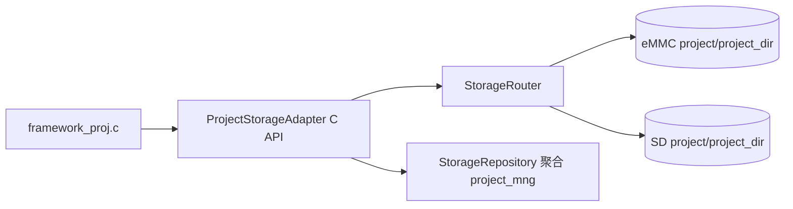

新增 `ProjectStorageAdapter`，为 C 模块提供轻量接口：

```c
int storage_project_get_package_path(StorageMedia media, const char *name, char *buf, size_t len);
int storage_project_get_workdir_path(StorageMedia media, const char *name, char *buf, size_t len);
int storage_project_resolve_write(StorageMedia requested, const char *name, StorageResolvedPath *out);
int storage_project_list(StorageRecord *records, int max_count, int *out_count);
```

旧函数内部逐步替换硬编码宏。为了降低改动风险，第一阶段可保留宏作为 eMMC 兼容默认值，但新增业务写入路径必须走 adapter。

### 6.3 方案加载和删除

1. 列表返回 `name + media + abs_path`。
2. 加载方案时必须指定 media；若旧协议未传 media，则通过聚合规则解析：同名 eMMC 优先。
3. 删除方案时必须删除对应 media 的包、工作目录和索引，不删除另一介质同名方案。
4. 当前运行方案来自 SD 时，如果 SD 异常移除，方案模块收到事件后应标记当前方案存储失效，禁止保存和导出；是否停止运行由产品确认。

### 6.4 方案 manifest 设计

`comif_get_project_list` 当前依赖 `fwif_get_project_num`、`fwif_get_project_info`、`fwif_get_project_switch_info` 读取内存中的方案管理信息，再组装 JSON 输出给 SCMVS/Web。引入 SD 后，列表接口不能每次通过解压 `.sln` 原始文件恢复方案信息，否则会带来明显卡顿。

SD 方案列表应维护独立 manifest。建议兼容旧结构并逐步扩展：

```json
{
  "Version": 2,
  "Media": "microSD",
  "CardId": "optional-card-id",
  "ProjectNum": 1,
  "ProjectList": [
    {
      "Name": "方案1",
      "CreateDateTime": "2026-05-04 10:00:00",
      "SlnFile": "方案1.sln",
      "SlnSize": 102400,
      "SlnMtime": 1777860000,
      "SlnHash": "optional-crc-or-sha256",
      "BaseImageName": "方案1.jpg",
      "SwitchInfo": {}
    }
  ]
}
```

实现上可以先复用现有 `project_mng.json` 字段，新增 `Version`、`Media`、`SlnFile`、`SlnSize`、`SlnMtime`、`SlnHash`、`IndexStatus` 等字段。设备写入 SD 方案时同步更新该 manifest。用户从 PC 拷贝方案到 SD 后，如果没有 manifest 或校验失败，界面不自动解压所有方案，而是提示用户触发后台扫描。

manifest 文件安全策略：

1. SD manifest 是不可信输入，不能直接驱动任意文件访问。
2. 读取时必须限制文件大小，例如不超过 1MB，避免恶意大 JSON 占内存。
3. `ProjectNum` 与数组长度必须一致且不超过产品方案数量上限。
4. `Name` 必须通过现有方案名合法性校验。
5. `SlnFile` 必须是单文件名或受限相对路径，禁止绝对路径和 `..`。
6. `SlnSize`、`SlnMtime` 与实际文件不一致时，该条目标记为 `IndexInvalid`，不进入默认列表。
7. 如果实现 `SlnHash`，hash 不一致时该条目不展示，并记录日志。
8. manifest 解析失败只影响 SD 方案，不影响 eMMC 方案返回。

可选增加 eMMC 侧缓存 `project/.project_manifest_cache.json`，用于保存 SD manifest 摘要和校验后的轻量列表：

```json
{
  "CardId": "optional-card-id",
  "ManifestMtime": 1777860000,
  "ManifestSize": 4096,
  "ManifestHash": "sha256",
  "VerifyResult": "OK",
  "CachedAt": "2026-05-04 10:01:00"
}
```

缓存只用于判断是否需要重新校验，不作为唯一真相。SD 文件发生变化、卡标识变化、manifest 摘要变化时，必须重新校验 SD manifest。

### 6.5 `comif_get_project_list` 聚合流程

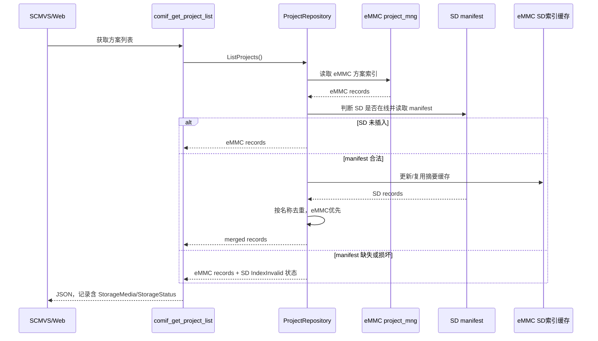

聚合后 JSON 建议保持旧字段不变，新增字段向后兼容：

```json
{
  "Name": "方案1",
  "CreateDateTime": "2026-05-04 10:00:00",
  "BaseImageName": "方案1.jpg",
  "SwitchLineCfg": "",
  "StorageMedia": "microSD",
  "StorageStatus": "Online",
  "IndexStatus": "Valid"
}
```

旧客户端忽略新增字段仍可显示方案名；新客户端可基于 `StorageMedia` 显示“本机/SD卡”来源。

## 7. 存图模块适配设计

### 7.1 当前问题

`source/algos/modules/saveimage/save_proc.*` 当前固定：

1. `DEVRAW_DIR="/mnt/data/save_img/"`
2. 空间检查使用 `osal_get_flash_info`，只看 eMMC。
3. 图片 DB `db_img_list_db` 固定 `/mnt/data/db/img_list_db`。
4. `AddOneDbImg` 先写 DB 再写文件，失败后回滚 DB，但不支持介质状态和拔卡取消。

### 7.2 适配方案

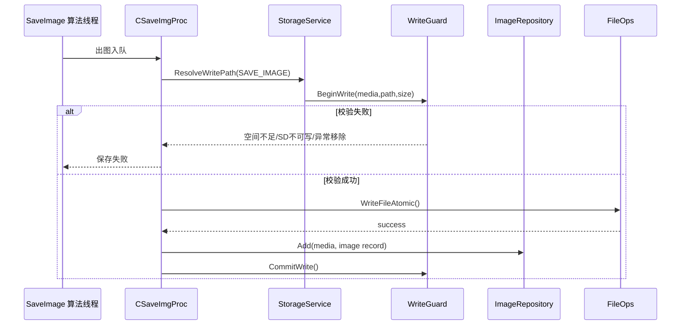

调整点：

1. `DEVRAW_DIR` 仅保留为 eMMC 兼容路径，不作为新写入固定值。
2. `FillSaveImgDataBase` 的 `path` 字段应写入介质解析后的目录，或增加 `media` 字段。
3. 图片 DB 改为按介质实例打开：eMMC DB 在 `/mnt/data/db/img_list_db`，SD DB 在 `<sd>/db/img_list_db`。
4. 查询图片列表时读取两个 DB，并按文件名去重。
5. 删除图片时根据记录 media 删除文件和对应 DB 记录。
6. 原有循环覆盖策略与需求“SD 空间满不自动清理”冲突：当目标为 SD 时应禁用自动删除旧图，直接返回空间不足；eMMC 是否保留旧逻辑需产品确认。

## 8. 训练图像/基准图模块适配设计

训练图像文件夹管理主要在 `baseimage` 的 `CImageSetManager` / `CImageSet` 一类对象中完成。当前路径由方案工作目录 `pwd` 派生，因此原则上应“跟随方案介质”。

适配原则：

1. 新建训练图像文件夹前，通过方案的 `media` 获取工作目录。
2. 删除文件夹通过 `StorageService::Delete`，便于统一日志、状态校验和异常处理。
3. 查询训练图像文件夹时同时聚合 eMMC 与 SD 的方案/训练目录。
4. SD 移除后，SD 上的训练图像文件夹自然不进入聚合结果。

## 9. UI/协议适配设计

新增或扩展的上层能力：

| 能力 | 输入 | 输出 |
| --- | --- | --- |
| 查询 SD 状态 | 无 | 状态、总容量、剩余容量、文件系统、是否可写、错误原因 |
| 安全弹出 | 无 | 成功/失败和提示 |
| 格式化 SD | 二次确认结果 | 成功/失败和提示 |
| 设置保存介质 | `eMMC/microSD/AUTO` | 当前保存策略 |
| 查询方案/图片/训练图像 | 可选 media 过滤 | 聚合列表，每条记录含 media |
| 删除训练图像文件夹 | media + path/name | 成功/失败 |
| 扫描 SD 方案 | 用户触发 | 后台扫描进度、扫描结果、重建 manifest 结果 |

错误码建议：

| 错误码 | 用户提示 |
| --- | --- |
| `STORAGE_E_SD_NOT_INSERTED` | SD卡未插入 |
| `STORAGE_E_SD_UNSUPPORTED_FORMAT` | 不支持的SD卡格式 |
| `STORAGE_E_SD_MOUNT_FAILED` | SD卡挂载失败 |
| `STORAGE_E_SD_READONLY` | SD卡不可写 |
| `STORAGE_E_NO_SPACE` | SD卡已满 / 空间不足 |
| `STORAGE_E_SD_REMOVED` | SD卡已被异常移除 |
| `STORAGE_E_WRITE_FAILED` | SD卡写入失败 |
| `STORAGE_E_FORMAT_FAILED` | SD卡格式化失败 |
| `STORAGE_E_SD_PROJECT_INDEX_INVALID` | SD卡方案索引异常 |

### 9.1 方案列表交互设计

界面策略采用“一个列表 + 来源标识 + 可选筛选”，不强制新增独立 SD 方案页签。

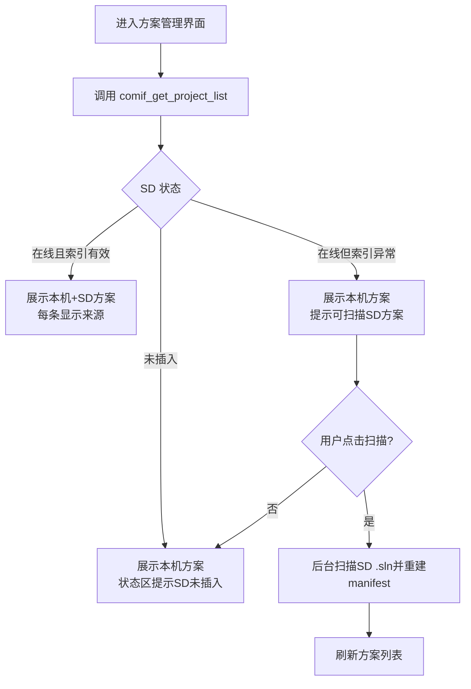

具体交互：

1. 默认显示“全部方案”，每条方案显示来源标签：`本机` 或 `SD卡`。
2. 提供筛选入口：全部、本机、SD卡。筛选只影响界面展示，不改变后端聚合规则。
3. SD 未插入时，不展示历史 SD 缓存方案，避免用户误以为可加载。
4. SD 在线但 manifest 缺失、损坏或校验失败时，列表仍可展示本机方案；SD 状态区提示“SD卡方案索引异常”，提供“扫描SD方案”操作。
5. “扫描SD方案”应后台执行，过程中展示扫描中状态，不阻塞本机方案操作。
6. 全部列表中同名方案按 eMMC 优先，只展示本机项；SD 筛选下可显示同名项并标记“与本机方案重名”。
7. SD 异常移除后，界面立即移除 SD 方案；正在加载或删除 SD 方案时返回统一错误提示。

## 10. 并发与异常策略

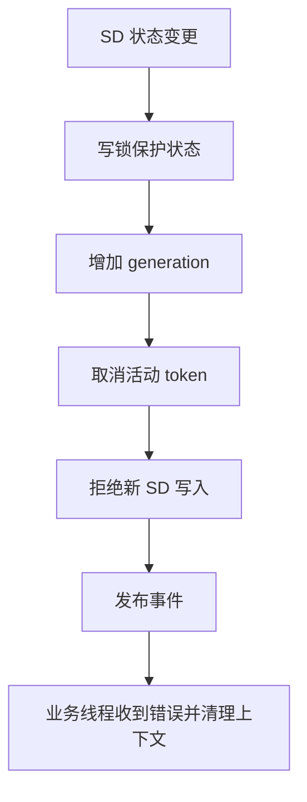

1. `MicroSdManager` 的状态变更需要互斥保护。
2. `WriteGuard` 持有活动写入 token 列表。
3. 安全弹出和异常移除均会取消 SD token。
4. 文件写入过程需要在关键阶段检查 token：写前、写后、rename 前、索引更新前。
5. 任何 SD 错误都不能直接导致主业务进程退出。

## 11. 测试设计

| 类型 | 用例 |
| --- | --- |
| 单元测试 | 路径解析、非法路径拦截、默认策略、聚合去重、错误码映射。 |
| 模块测试 | 挂载状态流转、格式校验、空间不足、写入 token 取消、原子写失败清理。 |
| 集成测试 | 新建方案默认写 SD、显式写 eMMC、图片保存到 SD、训练图像删除。 |
| 异常测试 | 写入中拔卡、弹出中有写入、格式化失败、mount 失败、SD 只读。 |
| 兼容测试 | 无 SD 时旧 eMMC 方案可读；旧 `/mnt/data` 图片和方案仍能聚合展示。 |
