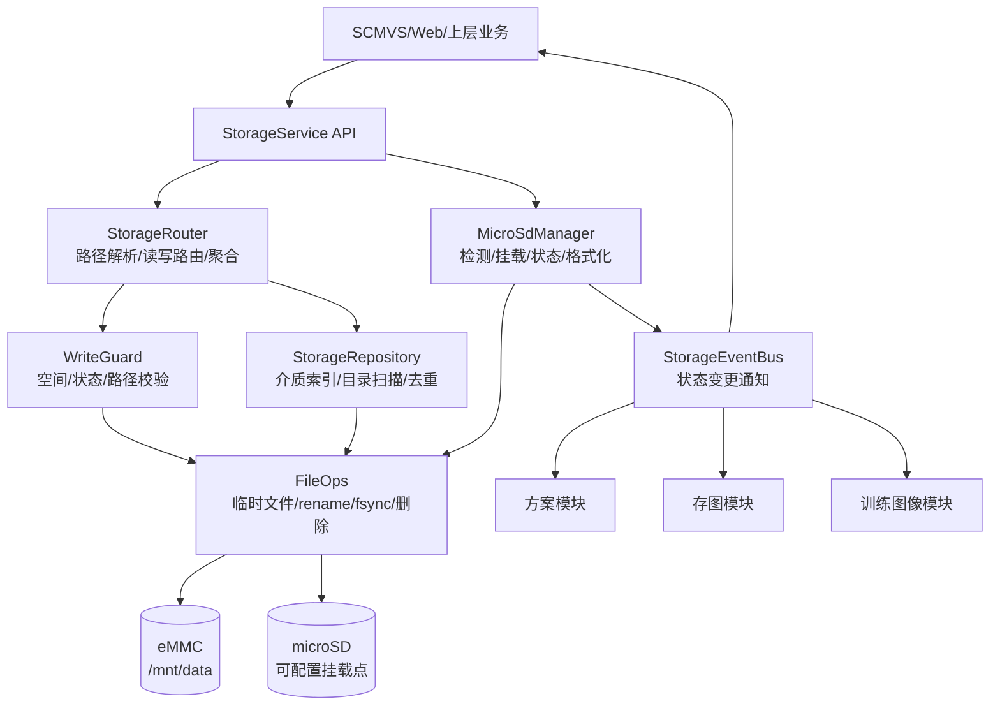
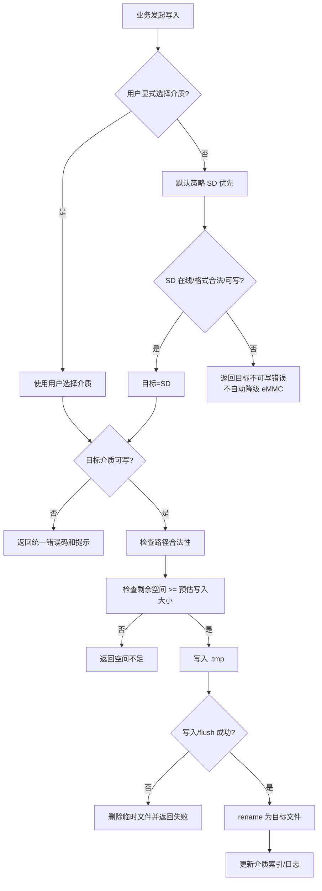
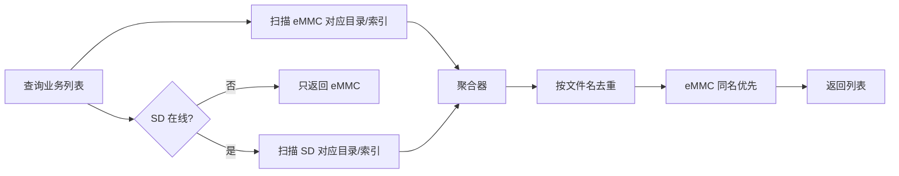
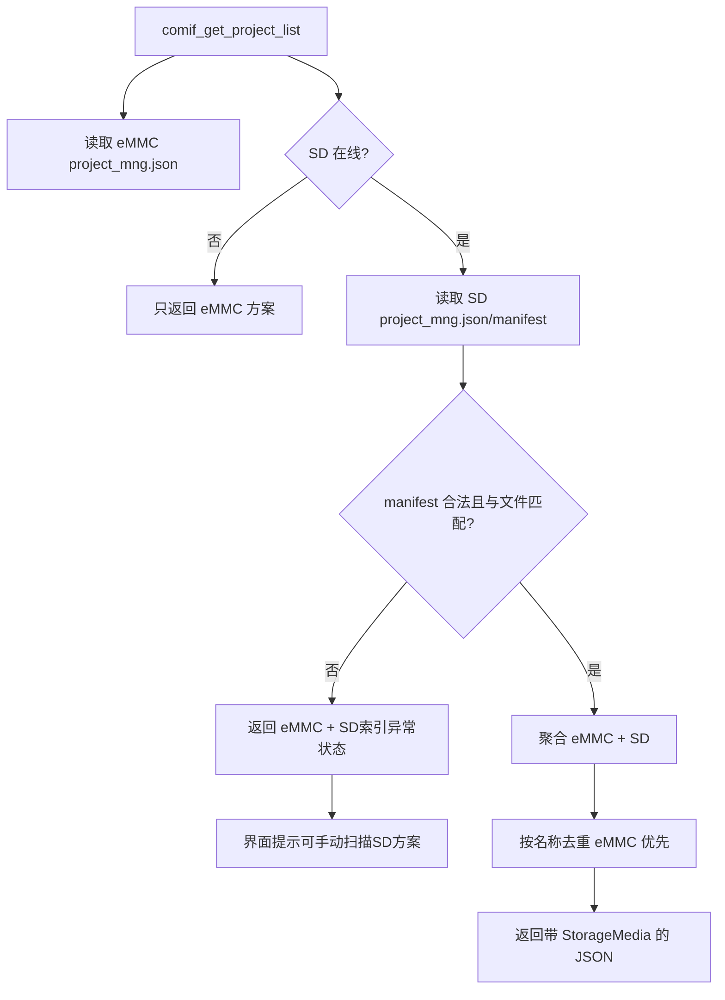
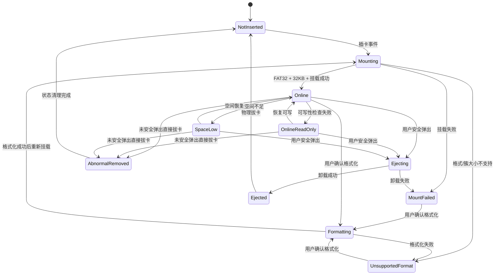

# microSD 卡设计概要文档

## 1. 设计目标

本文档基于 `doc/microSD_卡功能需求文档.md`，定义 microSD 卡能力的总体架构、模块边界、关键数据流和旧代码适配原则。

本阶段目标如下：

1. 新增 microSD 卡识别、挂载、状态、格式化、安全弹出能力。
2. 方案、图片、训练图像等业务文件支持 eMMC 与 microSD 两类介质。
3. 写入侧通过统一存储接口选择目标介质，不再在业务模块中硬编码 `/mnt/data`。
4. 读取侧支持 eMMC 与 microSD 聚合，按文件名去重，eMMC 优先。
5. microSD 异常、空间不足、格式不支持等场景统一错误码、提示与日志。

## 2. 关键结论

| 主题 | 设计结论 |
| --- | --- |
| 默认写入 | 默认策略为 SD 优先。SD 在线、格式合法、可写时写 SD；若目标不可写则报错，不自动降级。 |
| 用户选择 | 用户可显式选择 `microSD` 或 `eMMC` 作为保存介质。显式目标不可写时直接失败。 |
| 读取聚合 | 业务列表查询同时扫描 eMMC 与 SD，按文件名去重，eMMC 记录优先。 |
| 业务路径 | 方案、存图、测试/训练图像、业务索引通过 `StorageRouter` 解析绝对路径。 |
| 方案列表展示 | `comif_get_project_list` 不解压 `.sln` 原始包；优先读取 eMMC 与 SD 的方案 manifest，校验后聚合。 |
| 系统路径 | core dump、设备配置、ABI 缓存、系统日志、数据库基础目录等系统基础数据继续固定 eMMC。 |
| 索引治理 | 业务索引按介质独立维护，避免拔卡后 SD 数据仍残留在 eMMC 索引中展示。 |
| 写入保护 | 写入前检查状态、路径合法性、剩余空间；写入使用临时文件与原子 rename，失败清理残留。 |
| 安全弹出 | 弹出中拒绝新写入，取消或中断已有 SD 写任务，sync 后卸载。 |

## 3. 总体架构

新增 `StorageService` 作为统一入口。业务模块只表达“我要保存方案/图片/训练图像到某介质或默认介质”，不再直接拼接 `/mnt/data/project`、`/mnt/data/save_img` 等绝对路径。

## 4. 模块划分

| 模块 | 职责 | 典型接口 |
| --- | --- | --- |
| `MicroSdManager` | 监听插拔事件，执行识别、格式校验、挂载、卸载、格式化，维护状态机。 | `Init`、`GetState`、`SafeEject`、`Format` |
| `StorageRouter` | 解析业务目录，选择写入目标，提供 eMMC+SD 聚合读取。 | `ResolveWritePath`、`ResolveReadRoots`、`ListBusinessFiles` |
| `WriteGuard` | 写入前校验介质状态、可写性、剩余空间、路径合法性和弹出状态。 | `BeginWrite`、`CommitWrite`、`AbortWrite` |
| `FileOps` | 文件系统操作封装，支持临时文件、原子替换、目录创建、删除、sync。 | `WriteFileAtomic`、`Remove`、`Mkdirs`、`StatFs` |
| `StorageRepository` | 业务索引与目录扫描；负责跨介质聚合和按文件名去重。 | `ListProject`、`ListImages`、`MergeByName` |
| `StorageEventBus` | 将 SD 状态变化通知方案、存图、训练图像、界面等模块。 | `Subscribe`、`Publish` |

## 5. 存储目录规划

挂载点不在本文档中写死，建议通过编译宏或配置项定义：

| 介质 | 根目录示例 | 说明 |
| --- | --- | --- |
| eMMC | `/mnt/data` | 现有基础数据目录，继续保留。 |
| microSD | `MICROSD_MOUNT_ROOT` | 建议由平台层配置，例如 `/mnt/sdcard`。 |

业务目录使用相同相对路径：

| 业务类型 | 相对目录 | 当前硬编码示例 | 适配策略 |
| --- | --- | --- | --- |
| 方案包 | `project/` | `/mnt/data/project/` | 改为 `StorageRouter::ProjectPackageRoot(media)` |
| 方案工作目录 | `project_dir/` | `/mnt/data/project_dir/` | 改为 `StorageRouter::ProjectWorkRoot(media)` |
| 方案管理索引 | `project/project_mng.json` | `/mnt/data/project/project_mng.json` | 按介质独立索引，读取时聚合。 |
| 方案 manifest 缓存 | `project/.project_manifest_cache.json` | 无 | 可选 eMMC 缓存 SD manifest 摘要，用于判断 SD 方案列表是否变化。 |
| 基准图 | `project/base_image/` 或方案目录内 | `/mnt/data/project/base_image/` | 跟随方案所在介质。 |
| 保存图片 | `save_img/` | `/mnt/data/save_img/` | 跟随保存介质。 |
| 测试/训练图像 | `test_img/` | `/mnt/data/test_img/` | 跟随保存介质。 |
| 图片索引 | `db/img_list_db` | `/mnt/data/db/img_list_db` | 按介质独立打开或迁移为可配置 DB 路径。 |
| 测试图索引 | `db/test_img_list_db` | `/mnt/data/db/test_img_list_db` | 按介质独立打开或迁移为可配置 DB 路径。 |

系统基础目录不纳入 SD 路由：

| 路径/类型 | 原因 |
| --- | --- |
| `/mnt/data/core` | core dump 属于设备诊断数据，不应随 SD 拔出消失。 |
| `/mnt/data/dev_abi_conf.json` | 设备 ABI 缓存属于系统配置。 |
| `/mnt/data/db/oplog_list_db` | 操作日志数据库用于售后追踪，应固定 eMMC。 |
| `/mnt/data/storage_*_rec.json` | eMMC 寿命控制记录属于系统控制状态。 |
| `/mnt/data/model_bin/` | 深度学习公共模型目录是否迁移需单独评估，本阶段不默认迁移。 |

## 6. 写入策略

默认策略需要和产品结论保持一致：SD 不可写时本次默认写入失败，不静默写 eMMC。用户若希望无 SD 场景写 eMMC，需要在界面显式选择 eMMC。

## 7. 读取聚合策略

聚合结果中的每条记录应携带介质来源，供删除、导入、加载、详情展示等操作使用。界面当前可不新增“SD 卡方案”页签，但内部模型必须保留 `media` 字段，否则后续删除或加载同名项会产生歧义。

### 7.1 方案列表读取策略

当前界面通过 `comif_get_project_list` 组装 JSON 展示方案信息。引入 SD 后，不建议每次列表查询都解压 `.sln` 原始包获取元数据，因为 SD 随机读和解压耗时不可控，方案数量多时会阻塞界面刷新。

方案列表采用 manifest 优先策略：

SD 上可以维护 `project/project_mng.json` 或升级版 `.project_manifest.json`，但它只能作为“不可信索引”读取。设备生成、保存、删除 SD 方案时同步更新该文件；用户在 PC 上改动 SD 文件后，设备读取时必须做安全校验，校验失败时不展示伪造条目。

manifest 校验规则至少包括：

1. JSON schema、字段类型、字段长度和方案数量上限校验。
2. 方案名复用现有文件名合法性规则。
3. manifest 中引用的 `.sln` 文件必须真实存在，且路径不得越出 SD 方案目录。
4. 可记录并校验 `.sln` 的文件大小、mtime、CRC 或 hash。
5. 禁止绝对路径、`..`、空字节、控制字符等危险输入。
6. 校验失败只影响 SD 方案展示，不影响 eMMC 方案列表。

eMMC 可选维护一份 SD manifest 摘要缓存，记录卡标识、manifest mtime、文件大小、hash 和上次校验结果。再次插入同一卡且摘要未变化时，可直接复用缓存加速列表展示；摘要变化或缓存不存在时重新校验 manifest。缓存只用于性能优化，不能替代 SD 文件存在性和基本合法性检查。

### 7.2 界面交互建议

界面默认仍展示一个“全部方案”列表，避免破坏现有交互；在每条记录上增加来源标识：

| 字段 | 说明 |
| --- | --- |
| `StorageMedia` | `eMMC`、`microSD` |
| `StorageStatus` | `Online`、`Offline`、`IndexInvalid`、`ConflictHidden` |
| `BaseImageName` | 继续按现有字段返回；SD 方案从 SD manifest 和文件校验得到。 |

交互建议：

1. 默认列表展示 eMMC 方案和通过校验的 SD 方案，每条显示“本机”或“SD卡”来源。
2. 提供介质筛选：全部、本机、SD卡。是否做独立页签由界面资源决定。
3. SD 未插入时，只展示本机方案，并在 SD 状态区域提示“SD卡未插入”。
4. SD manifest 缺失或损坏时，不自动解压所有方案阻塞列表；提示“SD卡方案索引异常，可扫描修复”。
5. 用户点击“扫描SD方案”后，后台低优先级扫描 `.sln` 文件并重建 SD manifest，扫描中显示进度。
6. SD 异常拔出后，列表立即移除 SD 方案；若当前打开的是 SD 方案详情，提示“SD卡已被异常移除”。
7. 同名方案按 eMMC 优先。默认“全部方案”中屏蔽 SD 同名项；在 SD 筛选下可显示并标记“与本机方案重名”。

## 8. 状态机

## 9. 旧代码适配范围

当前扫描到的核心硬编码点如下：

| 文件 | 当前职责 | 适配建议 |
| --- | --- | --- |
| `source/fwk/project/framework_proj.c` | 方案包、方案工作目录、方案管理索引。 | 将 `PROJ_DIR`、`DEVSLN_DIR`、`PROJ_MNG_FNAME` 改为通过 storage API 获取；方案记录携带 `media`。 |
| `source/app/comif/communication_ifbase.h` | 业务路径宏集中定义。 | 保留兼容宏作为 eMMC 默认值，新增运行时 path resolver，逐步替换业务使用点。 |
| `source/app/comif/communication_interface.cpp` | SCMVS/Web 方案、存图、测试图接口。 | 查询接口改聚合，写入/删除/加载接口传递 `media` 或使用默认策略解析。 |
| `source/algos/modules/saveimage/save_proc.*` | 存图线程、存图目录、图片 DB。 | `DEVRAW_DIR` 改为运行时目录；写前调用 `BeginWrite`；DB 按介质写入。 |
| `source/misc/db/img_list_db/*.c` | 保存图片索引 DB。 | DB 文件路径从固定宏改为可配置或多实例，支持按介质查询。 |
| `source/misc/db/test_img_list_db/*.c` | 测试/训练图像索引 DB。 | 同图片索引策略。 |
| `source/algos/modules/baseimage/*` | 基准图和训练图像文件夹管理。 | 路径跟随方案介质；删除文件夹经 storage API。 |
| `source/middleware/emmc/*` | eMMC 寿命和写入控制。 | 不直接改为 SD；新增泛化存储状态能力时避免破坏现有 eMMC 寿命逻辑。 |

## 10. 风险与待确认

1. microSD 挂载点、设备节点、热插拔事件来源需要由平台层确认。
2. FAT32 32KB 簇大小检测方式需在目标系统验证；格式化命令参数需按 BusyBox/工具链能力确认。
3. 方案运行中拔出 SD 后，如果当前方案依赖 SD 上的模型/基准图，建议先进入错误状态并阻止保存/切换；是否强制停止运行需产品确认。
4. “至少 128GB”是仅验证范围还是容量准入门槛仍需确认。
5. 同名文件的写入冲突策略仍待确认；读取去重已按 eMMC 优先设计。
